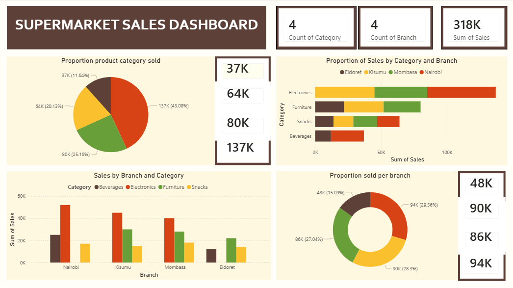

# DSA 3050 - Supermarket Sales Dashboard

## Assignment 2: Introduction to Power BI Dashboards

Author: Jessica Kimani
---------------------------------------------------------------------------------------

## Project Overview
Sales performance analysis across branches and product categories for a supermarket.

## Dashboard Preview

## Key Insights

1. **Branch with highest sales**: **Nairobi, valued at 94K**
2. **Category with highest sales**: **Electronics category values at 137K**
3. **Total Sales**: **318K**

## Files Included
- `DSA3050 AGGIGN2 DASHBOARD` → Power BI report file
- `Sales Dashboard Screenshot.png` → Final dashboard screenshot

## Tools Used
- Microsoft Power BI Desktop
- Microsoft Excel (Dataset)

---
